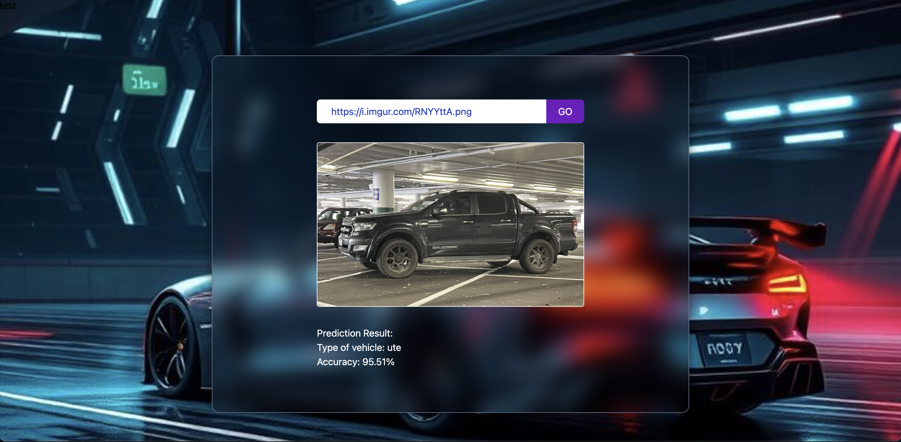

# Welcome to the frontend part of **Mission One** 🚀

### 🤓 The Project Brief:

The digital team at Turners would like to prototype a solution that allows a user to upload the picture of a car and then identify the type of vehicle, with the aim of calculating appropriate insurance premium for the customer based on the car type. Your task is to build a cloud-based application that can recognise motor vehicles types (e.g. sedan vs SUV vs truck, or if you want a challenge, try to make your application recognise a few brands and/or models) using a cloud-based AI service on Microsoft Azure.

### 🧩 Preview



### 🛠️ Tech Stack

- React + Vite
- Tailwind CSS

### 📝 Notes

- This is a prototype; most layout and logic are currently nested in component folder.
- Tailwind classes handle spacing, typography, and breakpoints.

### 🚀 Getting Started

```bash
npm install
npm run dev
```
